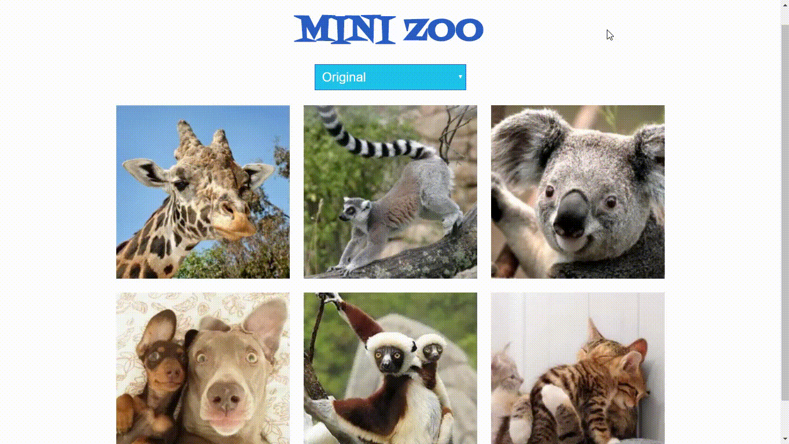

# Mini - Zoo
_____________

Esta página permite elegir efectos como sepia, blanco y negro e invertir colores que deseamos que obtengan nuestras imágenes. Deberás replicarla usando DOM y CSS.

## Detalles adicionales
-Para este maquetado se empleo : HTML5, CSS3 y Javascript.

  
  Cualquier consulta, duda o sugerencia puede realizarla al correo: adayc@hotmail.com
